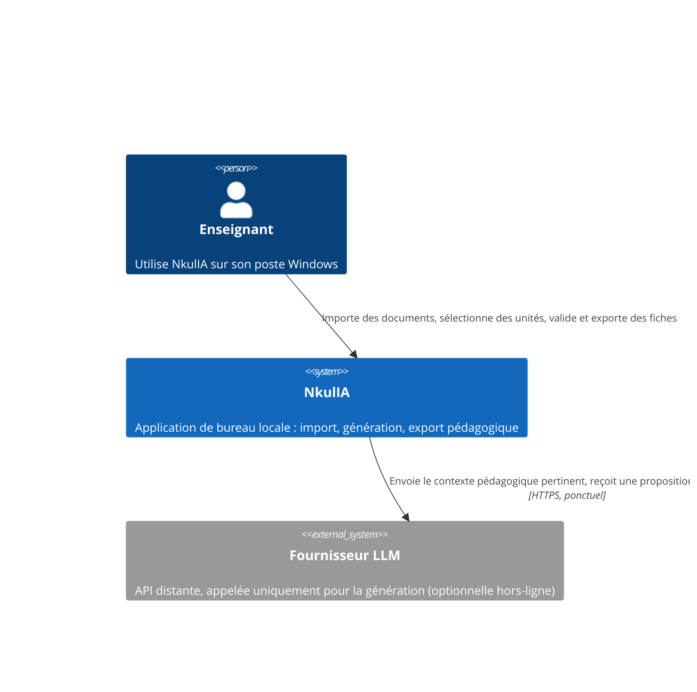
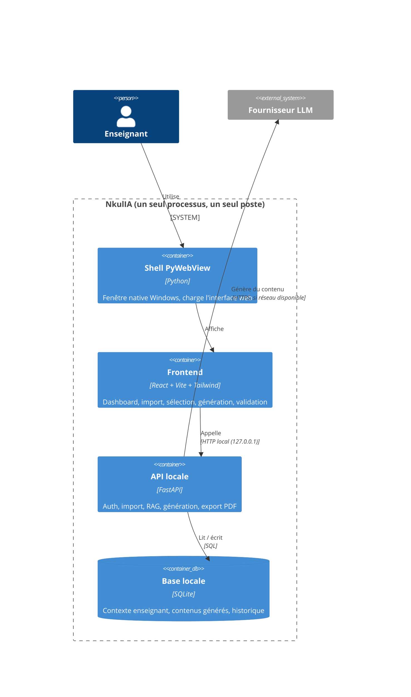
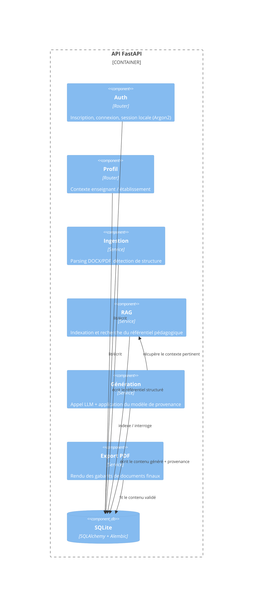

# Architecture

Ce document décrit *comment* le système est construit. Le *pourquoi*
de chaque choix structurant est dans [`docs/adr/`](adr/) — ce document
n'y revient pas en détail, il s'appuie dessus.

## Principes non négociables

1. **Offline-first** — voir [ADR-0001](adr/0001-architecture-offline-first.md). Aucune fonctionnalité du MVP ne doit exiger une connexion réseau permanente.
2. **Provenance obligatoire** — tout contenu généré porte l'une de ces quatre étiquettes : `reference`, `deduction`, `ai_recommendation`, `missing_information`. Un contenu étiqueté `reference` sans pointeur vers le document source est un bug, pas une fonctionnalité.
3. **Validation humaine avant export** — un document passe par les statuts `brouillon → analysé → proposé → modifié → validé` ; seul `validé` autorise l'export PDF définitif.
4. **`track_schema` neutre** — voir [ADR-0003](adr/0003-sqlite-plutot-que-postgres.md). Le vocabulaire d'une filière (UA/UE vs Chapitre/Leçon) est une donnée de configuration, jamais un nom de colonne ou de table.

## Vue C4 — Niveau 1 : Contexte système



## Vue C4 — Niveau 2 : Conteneurs



## Vue C4 — Niveau 3 : Composants de l'API



## Modèle de données (extrait — MVP)

```
Institution 1───* Teacher
Institution 1───* SchoolYear
Institution 1───* Classroom *───1 SchoolYear
Teacher 1───* AuthSession
Teacher *───* Classroom (via TeachingAssignment) *───* Subject
```

Détail des champs : voir les modèles SQLAlchemy dans `backend/app/db/models.py`
(ajoutés en [PR-03](PULL_REQUESTS.md#pr-03--featauth-persist-teacher-context-and-local-authentication)).

## Contrat de génération (extrait)

Toute réponse du service de génération respecte ce schéma minimal :

```json
{
  "field": "objectif_general",
  "value": "Identifier et connecter les périphériques d'un ordinateur",
  "provenance": "reference",
  "source_ref": "fiche_progression_seconde.docx#L42"
}
```

`provenance` ∈ `{reference, deduction, ai_recommendation, missing_information}`.
`source_ref` est obligatoire si `provenance = reference`, absent sinon.
Un contrôle automatisé (issue [#12](ISSUES.md#12--modèle-de-provenance-dans-le-pipeline-de-génération))
rejette toute réponse qui ne respecte pas ce contrat avant qu'elle
n'atteigne l'interface.

## Ce qui est explicitement hors périmètre (et pourquoi)

| Hors périmètre | Raison |
|---|---|
| Déploiement serveur (Render, Fly.io, VPS) | Pas de serveur : voir ADR-0001 |
| Postgres, Redis, Celery | Pas de charge concurrente ni de tâche de fond partagée : voir ADR-0003 |
| Prometheus / Grafana | Rien à superviser en continu, pas de service toujours actif |
| Synchronisation multi-postes | Hors MVP — ferait l'objet d'un nouvel ADR si un besoin réel apparaît |
